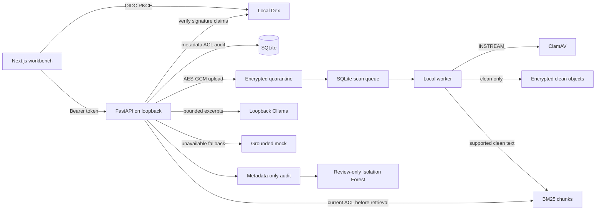

# CloudVault architecture

## Implemented local Phase 1 path

Next.js local workbench → Dex code flow + PKCE → FastAPI → RS256/issuer/audience/expiry validation → current per-file ACL → SQLite metadata, versions, shares, audit, and text chunks.

FastAPI encrypts uploads into a local quarantine folder. A local queue worker submits each object to ClamAV through INSTREAM. Only clean objects are promoted to the encrypted clean folder. Clean text is indexed with BM25 after current ACL filtering. The assistant calls local Ollama if available or returns a grounded mock. A local Isolation Forest scores activity and creates review-only findings.

The Phase 1 application is a single-machine prototype. SQLite and encrypted local files keep the default setup dependency-light and free. PostgreSQL/pgvector, S3Mock, and Redis remain optional Compose comparison services; the current app does not depend on them. The filesystem store uses an AES-GCM key kept under the ignored local data directory. The scanner only promotes a clean result; unavailable, failed, and infected scans remain inaccessible.

### Local data flow

The arrows describe the implemented local flow. ClamAV, Ollama, and Dex require their optional local services; the mock response path and health endpoint can run without hosted inference. No arrow in this diagram reaches AWS or a hosted AI service.

## Local-to-AWS learning map (not deployed)

| Capability | Phase 1 local implementation | AWS target design | Future review items |
|---|---|---|---|
| Identity | Dex, code flow + PKCE, verified synthetic identities | Cognito user pool / identity federation | Real user lifecycle, MFA, recovery, claims, issuer/audience |
| API | FastAPI on loopback | API Gateway plus Lambda or ECS Fargate | Private networking, auth authorizer, quotas |
| Metadata and ACLs | SQLite tables and per-file permission checks | RDS PostgreSQL; optionally pgvector extension | Migration, tenant keys, indexes, backups, connection costs |
| File objects | AES-GCM encrypted local quarantine/clean folders | Separate S3 staging and clean buckets with versioning | Block public access, IAM, bucket policies, checksums, lifecycle |
| Malware scans | ClamAV INSTREAM worker and persisted queue state | SQS plus isolated ECS Fargate scanner or reviewed Lambda pattern | Image supply chain, resource limits, retries, DLQ, signature updates |
| Audit | SQLite metadata-only user event trail | CloudTrail management/data events plus application audit in CloudWatch/S3 | Retention, redaction, immutable archive, data-event charges |
| Detection | Synthetic-trained local Isolation Forest | GuardDuty for AWS threat telemetry plus application behavior analytics | Enabled data sources, region, event volume, false positives |
| RAG | Current-user ACL-filtered BM25 chunks; local Ollama or grounded mock | Bedrock optional for model inference; RDS/pgvector or reviewed vector store | Provider privacy, token caps, region, per-model price, injection defense |
| Keys and config | Ignored local AES key and environment settings | KMS and Secrets Manager/Parameter Store | Key rotation, encryption context, request charges |
| Web hosting | Local Next.js only | Static hosting or separately costed hosting | Vercel plan eligibility, API placement, data egress |

S3Mock is only a local S3 API test double. It is not used by the current app and does not reproduce AWS IAM, KMS, bucket policy, lifecycle, or production availability. PostgreSQL/pgvector is similarly a future learning/integration target; the current BM25 retrieval implementation does not claim vector-search semantics.

## AWS reference blueprint (not deployed)

`infra/aws/` contains a deliberately small Terraform example for S3 quarantine/clean buckets, a scan queue and dead-letter queue, short-retention application logs, and optional Cognito/GuardDuty resources. `enable_resources` defaults to false, and optional services also default off. This is an IaC learning artifact, not a complete cloud deployment: it has no API/web compute, scanner task, PostgreSQL database, VPC, KMS key, CloudTrail trail, budget notification, or RAG inference wiring. These omissions are deliberate until an account-specific cost and security review selects the final topology.

The buckets use S3-managed encryption as a baseline and do not demonstrate customer-managed KMS keys. Local AES-GCM behavior remains separate. The Terraform configuration does not migrate the current SQLite/filesystem application to AWS, and no Terraform provider was initialized as part of this local source change.

## Security-critical workflows

### Upload, version, scan, and download

1. Authenticate the request and cap the raw upload body at 10 MiB. The API accepts a simple filename, computes SHA-256, encrypts the object with AES-GCM, records a version, and writes a metadata-only audit event.
2. New objects enter the quarantine directory; no download route reads from that directory.
3. The local worker submits the bytes to ClamAV via INSTREAM. Worker failures and malware detections remain quarantined. Only a clean scan is promoted to the clean namespace and indexed.
4. Download re-checks the current user ACL and latest version's scan state on each request. It returns an opaque binary attachment only when clean.

### Sharing and audit

1. OIDC signatures and required claims are verified before a request receives a local principal.
2. Owners can grant the other seeded same-tenant account read or write; collaborators without access receive a non-disclosing 404. Revocation is immediate because each request checks SQLite's current share table.
3. Audit records include actor, action, resource ID, size/checksum where applicable, and timestamp. They never include document text, tokens, or secrets. The endpoint exposes only the requesting user's own events in this demo.

### Permission-aware RAG

1. Only text from clean versions is indexed. Current supported formats are UTF-8 .txt, .md, .csv, and .json, bounded to 500,000 characters per file.
2. Retrieval joins clean chunks to current file ownership/shares before ranking, so unauthorized chunks do not enter the model context.
3. The prompt labels excerpts as untrusted and forbids following embedded instructions. The response cites file, version, and chunk; if Ollama is unavailable, a clearly named mock returns the grounded excerpts.

### Anomaly review

The local Isolation Forest is trained on synthetic normal activity and scores per-user audit aggregates. Findings include feature-level reasons and are stored for review; the model never blocks accounts, changes access, or deletes content. Synthetic metrics are a demonstration fixture, not evidence of operational detection quality.

## Deployment safety boundary

Phase 2 includes a disabled-by-default AWS reference configuration, not an active deployment. It must first verify current credit balance and service eligibility in the user's AWS account, estimate the exact milestone and taxes/FX with current regional prices, add alerts/limits, and define teardown. Credits are not treated as a zero-cost guarantee. Do not enable Terraform resources or deploy until the owner has reviewed and approved the exact estimate.
