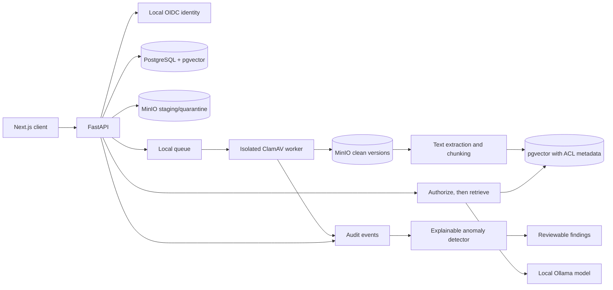

# CloudVault architecture (working proposal)

## Local-first architecture

## AWS target mapping (not deployed)

| Capability | Local implementation | AWS target |
|---|---|---|
| Identity | Local OIDC provider | Cognito |
| API and workers | FastAPI and local worker | API Gateway, Lambda, ECS Fargate where needed |
| Object storage | MinIO | S3 staging and clean buckets with versioning/lifecycle |
| Queue | Local queue | SQS |
| Metadata and vectors | PostgreSQL + pgvector | RDS PostgreSQL/Aurora after cost review |
| Keys and secrets | Local development configuration | KMS and Secrets Manager/Parameter Store |
| Audit and detection | Local audit store and ML detector | CloudTrail, CloudWatch, GuardDuty |
| AI | Ollama local model | Optional Bedrock adapter |

All AWS infrastructure must default to plan-only/no deployment. Before any deployment or paid usage, present the Region, exact resources, usage assumptions, expected charges including applicable tax, credit eligibility, maximum exposure, and teardown steps for review. Proceed only after explicit approval of that specific action.

## Security-critical flows

### Upload and malware disposition

1. Authenticate and authorize an upload intent; enforce tenant, folder, and quota limits.
2. Upload only to staging/quarantine. Record the exact object version and checksum.
3. Queue a scan job. A restricted worker scans a read-only copy with resource and archive limits.
4. Clean objects may be promoted. Infected, pending, or failed objects remain inaccessible to download; retry requires an authorized action.
5. Every transition emits an audit event. Downloads re-check both authorization and clean scan status.

### Permission-aware RAG

Extract text only from clean files. Store tenant, ACL, source version, and chunk metadata. Resolve the user's current authorized resources from the source of truth and filter retrieval before any content reaches the model. Treat retrieved text as untrusted evidence, never as instructions. Provide citations and abstain when evidence is missing.

### Anomaly detection

Start with generated synthetic events. Evaluate a transparent baseline and report precision, recall, and false positives. Findings are review-only; the model must not automatically block users or delete files.
